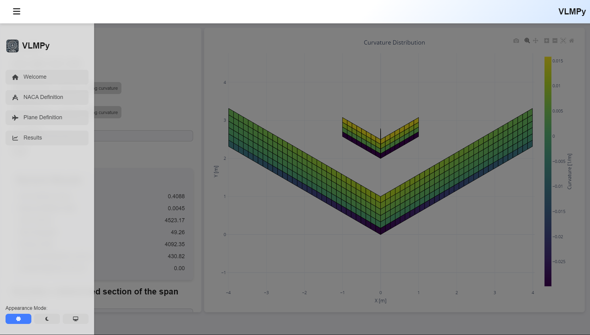

# VLMPy: Vortex Lattice Method App

<p align="center">
    
</p>

**VLMPy** is a modern, open-source Python toolkit and application for aerodynamic analysis of wings using the Vortex Lattice Method (VLM). Designed for engineers, students, and enthusiasts, VLMPy makes it easy to model, visualize, and analyze lift and drag for a wide range of wing configurations in subsonic, inviscid flow.


[](LICENSE)
[](https://github.com/JaviLendi/VLMPy/issues)
[](https://github.com/JaviLendi/VLMPy/stargazers)
[](https://github.com/JaviLendi/VLMPy/network/members)
[](https://github.com/JaviLendi/VLMPy/commits/main)
[](https://www.python.org/downloads/)
[](https://github.com/JaviLendi/VLMPy/releases)
[](https://github.com/JaviLendi/VLMPy)


---

## Table of Contents

- [VLMPy: Vortex Lattice Method App](#vlmpy-vortex-lattice-method-app)
  - [Table of Contents](#table-of-contents)
  - [Introduction](#introduction)
  - [Features](#features)
    - [Screenshots](#screenshots)
  - [Installation](#installation)
    - [Prerequisites](#prerequisites)
    - [Option 1: Windows Executable (Windows 10/11)](#option-1-windows-executable-windows-1011)
    - [Option 2: Install from Source](#option-2-install-from-source)
  - [Usage](#usage)
  - [Project Structure](#project-structure)
  - [Submitting Issues](#submitting-issues)
  - [License](#license)
  - [Author](#author)
  - [Acknowledgements](#acknowledgements)

---

## Introduction

**VLMPy** is an open-source Python tool for aerodynamic analysis of wings using the Vortex Lattice Method (VLM). It is designed for aerospace engineers, students, and aviation enthusiasts to model lift and drag in subsonic, inviscid flow conditions. This project began as a Final Year Project in Aerospace Engineering.

---

## Features

- **Accurate VLM Implementation**: Compute aerodynamic coefficients ($C_L$, $C_D$, moments) for wing configurations.
- **Interactive Visualization**: 2D/3D plots of lift distribution, pressure coefficients, and geometry using Plotly and Matplotlib.
- **Customizable Geometry**: Define wing parameters like sweep, dihedral, taper, and control surfaces.
- **Flexible Flight Conditions**: Analyze multiple angles of attack, sideslip angles, and airspeeds.
- **NACA Airfoil Support**: Generate and analyze NACA airfoil profiles.
- **Modular Architecture**: Extensible Python codebase for custom analyses and integration with NumPy, Matplotlib, and more.
- **User-Friendly Interface**: Intuitive Python API, ready-to-use executables, and Jupyter notebook examples.
- **Comprehensive Documentation**: Step-by-step guides and practical examples.

---
### Screenshots

<div align="center">

|  |  |
|:--:|:--:|
| Welcome | Main Menu |

|  |  |
|:--:|:--:|
| Wing Curvature | 3D Wing Discretization (A320) |

</div>

<details>
<summary>View all screenshots</summary>

- **Welcome**  
   

- **Main Menu**  
   

- **Wing Curvature**  
   

- **3D Wing Discretization (A320)**  
   

- **Vorticity Distribution (Flat Plate with Aileron)**  
   

</details>

## Installation

### Prerequisites

- **Python 3.8+** (for source installation)
- **Web Browser** (Chrome 90+, Firefox 85+, or equivalent)
- **Git** (optional, for cloning the repository)
- 
### Option 1: Windows Executable (Windows 10/11)

1. Download `app.exe` from the [Releases page](https://github.com/JaviLendi/VLMPy/releases).
2. Double-click to launch the application—no additional setup required.

### Option 2: Install from Source

1. Clone the repository:
   ```bash
   git clone https://github.com/JaviLendi/VLMPy.git
   cd VLMPy
   ```
2. Install dependencies:
   ```bash
   pip install -r requirements.txt
   ```
   *Tip*: Update pip with `pip install --upgrade pip` if needed.
3. Run the app:
   ```bash
   python app.py
   ```
4. Access the web interface at [http://localhost:5000](http://localhost:5000).

---
## Usage

- **Executable**: Launch `app.exe` (Windows) for a standalone experience.
- **Python API**: Import VLMPy modules in your scripts for custom analyses (see `src/lib/`).
- **Jupyter Notebooks**: Explore example notebooks in the `notebooks/` directory for guided tutorials.
- **Web Interface**: Run `app.py` to access the interactive web app at [http://localhost:5000](http://localhost:5000).

Example scripts and documentation are available in the `notebooks/` and `docs/` directories.

---

## Project Structure

```
VLMPy/
├── src/                  # Source code
│   ├── lib/              # Core VLM and utility modules
│   │   ├── vlm.py        # Vortex Lattice Method implementation
│   │   ├── naca.py       # NACA airfoil generation utilities
│   │   ├── geometry.py   # Wing geometry creation and manipulation
│   ├── static/           # Static assets (images, data files)
│   ├── templates/        # HTML templates for web interface
│   └── app.py            # Application entry point
├── notebooks/            # Example Jupyter notebooks
├── docs/                 # Documentation and project reports
├── requirements.txt      # Python dependencies
├── README.md             # Project documentation
└── LICENSE               # License information
```

---


## Submitting Issues

Found a bug or have a suggestion? Please open an issue on GitHub.

1. Search existing issues to avoid duplicates.
2. Provide a clear title and detailed description.
3. Include steps to reproduce, expected behavior, and relevant screenshots or logs if possible.

Your feedback helps improve VLMPy!

---

## License

VLMPy is distributed under the [GNU Affero General Public License v3.0 (AGPL-3.0)](LICENSE).

---

## Author

**Javier Lendínez Castillo**  
_Aerospace Engineer_

- 💼 GitHub: [@JaviLendi](https://github.com/JaviLendi)
- 🏫 Universidad Alfonso X el Sabio 

---


## Acknowledgements

- **Supervisor**: Héctor Gómez Cedenilla
- **Institution**: Universidad Alfonso X el Sabio
- **Date**: June 2025

- **Additional Acknowledgements**: Marcos Antonio Rodríguez and Ignacio Maroto Villar, professors at Universidad Alfonso X el Sabio

> ℹ️ For academic details and mathematical derivations, see `docs/TFG.pdf` (coming soon) and source code appendices.

---